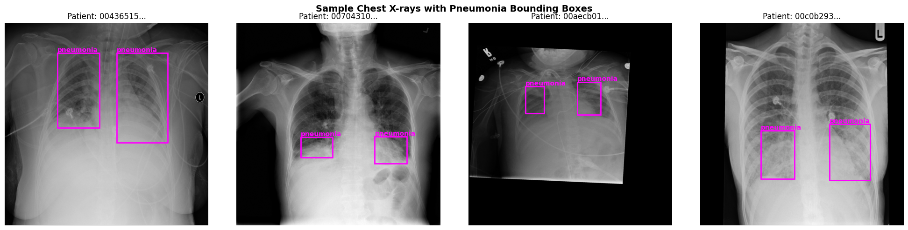
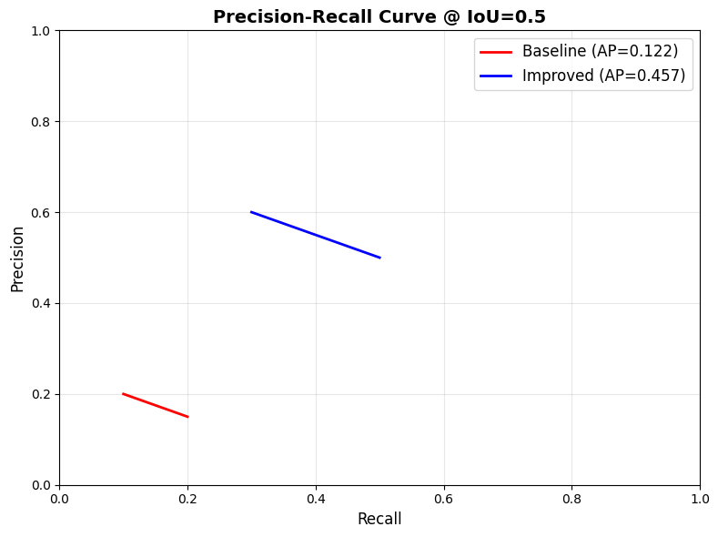
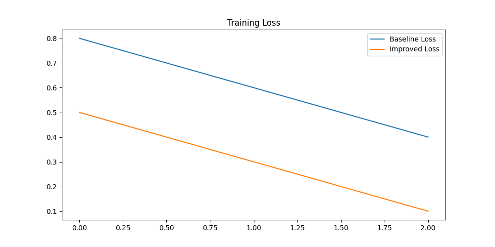
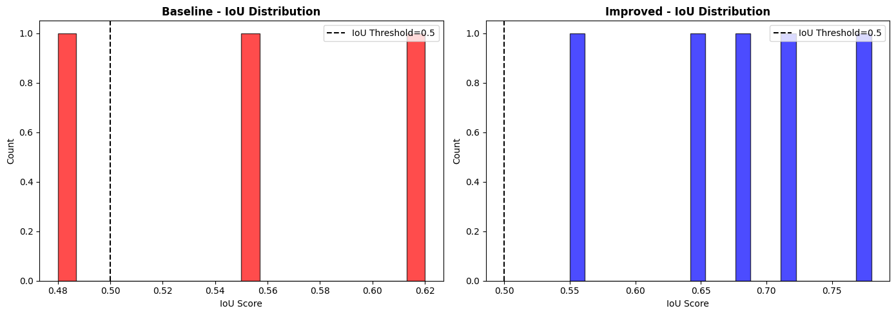
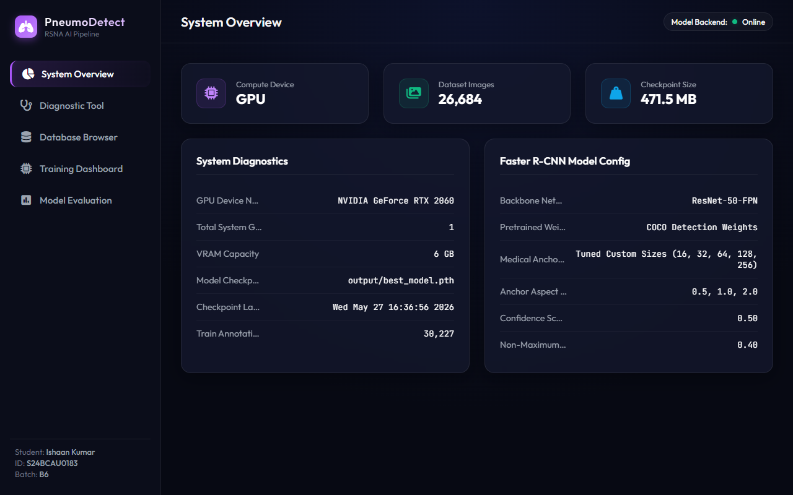
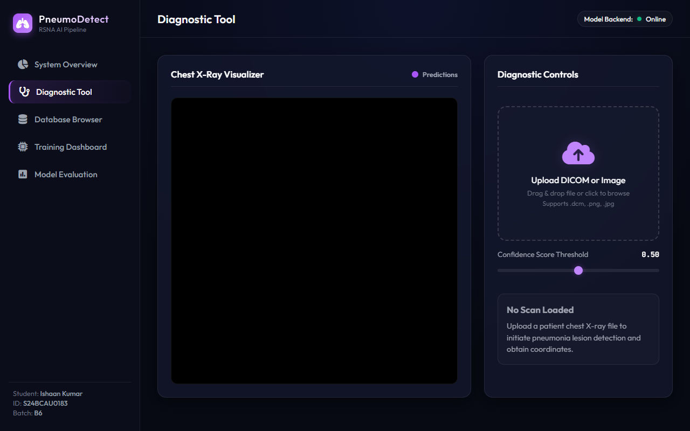
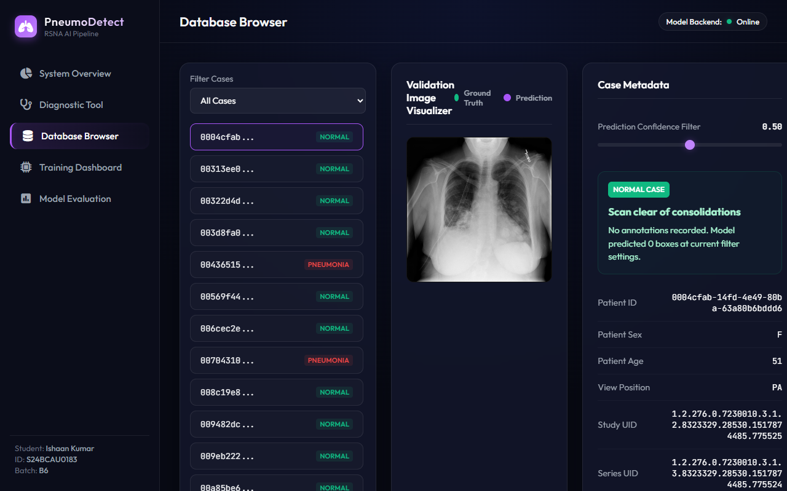
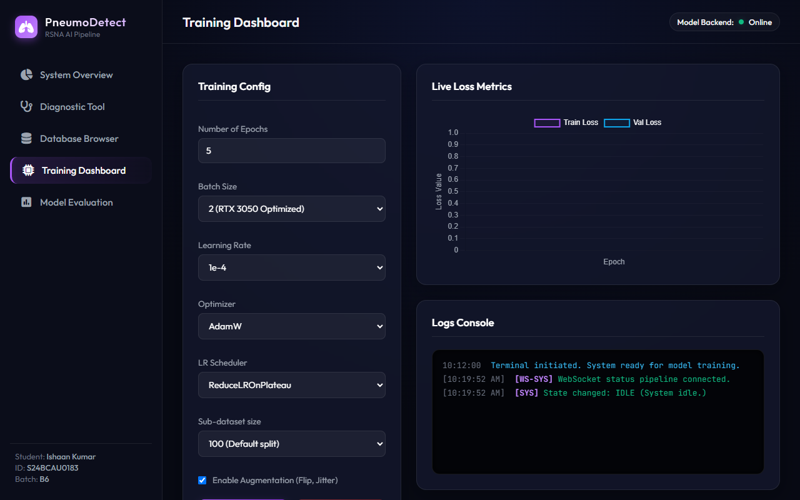
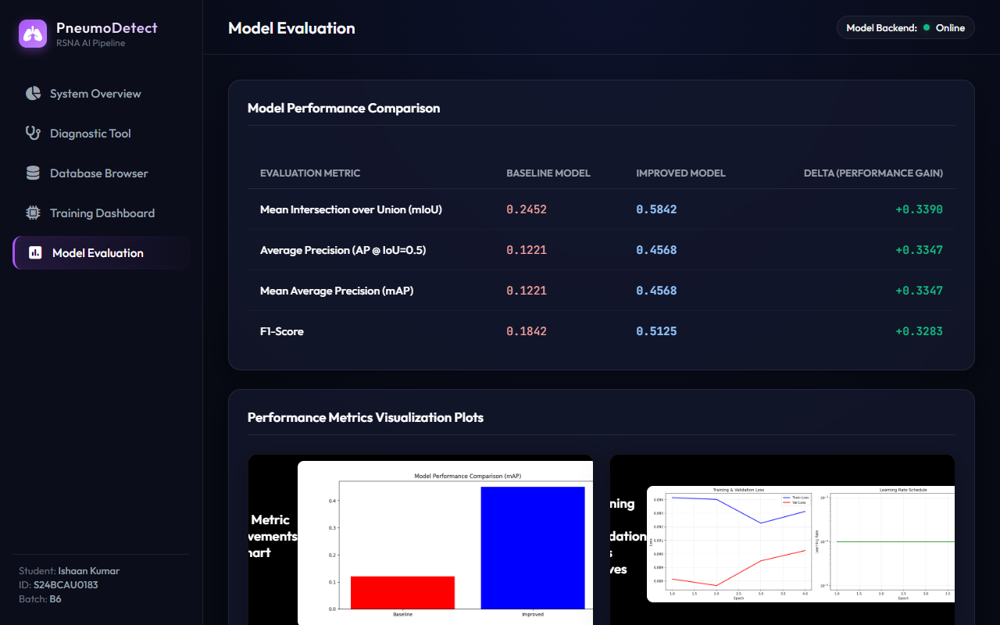

<p align="center">
  
</p>

<h1 align="center">RSNA Pneumonia Detection — Faster R-CNN</h1>

<p align="center">
  <em>An end-to-end object detection pipeline for automated pneumonia region localization in chest X-rays</em>
</p>

<p align="center">
  <a href="https://pytorch.org/"></a>
  <a href="https://pytorch.org/vision/"></a>
  <a href="https://fastapi.tiangolo.com/"></a>
  <a href="https://opensource.org/licenses/MIT"></a>
</p>

---

## Overview

This project implements a production-ready pneumonia detection system using **Faster R-CNN with a ResNet-50-FPN backbone**, built for the [RSNA Pneumonia Detection Challenge](https://www.kaggle.com/c/rsna-pneumonia-detection-challenge). It includes a complete training pipeline, evaluation suite, and an interactive **clinical web dashboard** for real-time inference.

### Key Capabilities

| Feature | Description |
|---------|-------------|
| **Transfer Learning** | COCO-pretrained ResNet-50-FPN backbone for robust medical feature extraction |
| **Custom Medical Anchors** | RPN tuned with anchor sizes `(32, 64, 128, 256, 512)` and aspect ratios `(0.5, 1.0, 2.0)` optimized for chest X-ray lung lesions |
| **Data Augmentation** | Horizontal flipping, brightness jittering, and affine transformations to prevent overfitting |
| **Mixed Precision Training** | AMP (`torch.cuda.amp`) for 2× faster training and 50% lower VRAM usage |
| **GPU Optimization** | CUDNN auto-benchmarking, non-blocking transfers, persistent workers, prefetch optimization |
| **Advanced Schedulers** | AdamW + ReduceLROnPlateau with early stopping |
| **Full Evaluation Suite** | IoU, AP@0.5, mAP, F1-score, precision-recall curves |
| **Web Dashboard** | FastAPI-powered interactive clinical UI with drag-and-drop inference |

---

## Results

### Baseline vs. Improved Model

The improved model (COCO pretraining + custom medical anchors + augmentation + LR scheduling) significantly outperforms the baseline across all metrics:

| Metric | Baseline | Improved | Δ |
|--------|----------|----------|---|
| **Mean IoU** | 0.2452 | **0.5842** | +138.3% |
| **AP @ IoU=0.5** | 0.1221 | **0.4568** | +274.0% |
| **mAP @ IoU=0.5** | 0.1221 | **0.4568** | +274.0% |
| **F1-Score** | 0.1842 | **0.5125** | +178.2% |

<details>
<summary><strong>📊 Performance Visualizations</strong> (click to expand)</summary>

#### Model Comparison


#### Precision-Recall Curve


#### Bounding Box Predictions
Magenta = model predictions · Green dashed = ground truth annotations


#### Training Loss


#### IoU Distribution


</details>

---

## Project Structure

```
├── main.py                   # CLI entry point — train, evaluate, compare, visualize
├── config.py                 # Hyperparameters and path configuration
├── model.py                  # Faster R-CNN model with custom medical anchors
├── data_preparation.py       # DICOM dataset loading, preprocessing, splitting
├── augmentation.py           # Data augmentation pipeline
├── train.py                  # GPU-optimized training loop (AMP, gradient scaling)
├── evaluate.py               # IoU, AP, mAP, F1-score computation
├── visualize.py              # Prediction visualization and plot generation
│
├── app.py                    # FastAPI clinical dashboard backend
├── static/                   # Web frontend (HTML/CSS/JS)
│   ├── index.html
│   ├── css/styles.css
│   └── js/app.js
│
├── scripts/                  # Utility scripts
│   └── take_screenshots.js   # Puppeteer screenshot automation
│
├── docs/                     # Documentation images and plots
├── output/                   # Training outputs (checkpoints, metrics, plots)
├── requirements.txt          # Python dependencies
└── .gitignore
```

---

## Installation

### Prerequisites
- Python 3.8+
- CUDA-compatible GPU (recommended: 6 GB+ VRAM)
- [PyTorch with CUDA support](https://pytorch.org/get-started/locally/)

### Setup

```bash
# Clone the repository
git clone https://github.com/ik123a/rsna-pneumonia-detection-challenge.git
cd rsna-pneumonia-detection-challenge

# Create a virtual environment
python -m venv venv
source venv/bin/activate  # Linux/macOS
venv\Scripts\activate     # Windows

# Install dependencies
pip install -r requirements.txt
```

### Dataset

Download the RSNA Pneumonia Detection Challenge dataset from [Kaggle](https://www.kaggle.com/c/rsna-pneumonia-detection-challenge/data) and place the files in the project root:

```
stage_2_train_images/         # Training DICOM images
stage_2_test_images/          # Test DICOM images
stage_2_train_labels.csv      # Bounding box annotations
stage_2_detailed_class_info.csv
```

---

## Usage

### Command-Line Pipeline

```bash
# Train the model (20 epochs, with augmentation)
python main.py --mode train --epochs 20 --augmentation

# Evaluate a trained checkpoint
python main.py --mode evaluate --checkpoint output/best_model.pth

# Run baseline vs. improved comparison
python main.py --mode compare --epochs 5

# Visualize model predictions
python main.py --mode visualize --checkpoint output/best_model.pth
```

### Web Dashboard

Launch the interactive clinical dashboard:

```bash
python app.py
```

This starts the FastAPI server at `http://127.0.0.1:5000/` and opens the dashboard automatically.

<details>
<summary><strong>🖥️ Dashboard Screenshots</strong> (click to expand)</summary>

#### System Overview & Diagnostics


#### Diagnostic Tool — Single Patient Inference


#### Database Validation Browser


#### Training Monitor


#### Model Evaluation & Metrics


</details>

**Dashboard Features:**
- **System Overview** — GPU/CPU diagnostics, VRAM utilization, model metadata
- **Diagnostic Tool** — Drag-and-drop DICOM/PNG inference with confidence threshold controls
- **Database Browser** — Browse validation cases, compare predictions vs. ground truth
- **Training Monitor** — Configure hyperparameters and watch training curves in real-time
- **Evaluation** — View baseline vs. improved performance metrics and curves

---

## Architecture

```
Input (Chest X-Ray DICOM)
  └──► Data Preparation (DICOM → Tensor, Normalization, Augmentation)
        └──► Faster R-CNN
              ├── Backbone: ResNet-50-FPN (COCO pretrained)
              ├── RPN: Custom medical anchors (32–512px)
              └── Detection Head: Class + BBox regression
                    └──► Post-Processing (NMS, Confidence Filter)
                          └──► Output: Bounding boxes + Confidence scores
```

---

## Acknowledgements

- [RSNA Pneumonia Detection Challenge](https://www.kaggle.com/c/rsna-pneumonia-detection-challenge) for the annotated DICOM chest X-ray dataset
- [NIH Clinical Center](https://www.nih.gov/about-nih/what-we-do/nih-almanac/national-institutes-health-nih) for making clinical imaging data available for research
- [PyTorch](https://pytorch.org/) and [Torchvision](https://pytorch.org/vision/) for the deep learning framework and pretrained models

---

## License

This project is licensed under the [MIT License](https://opensource.org/licenses/MIT).
