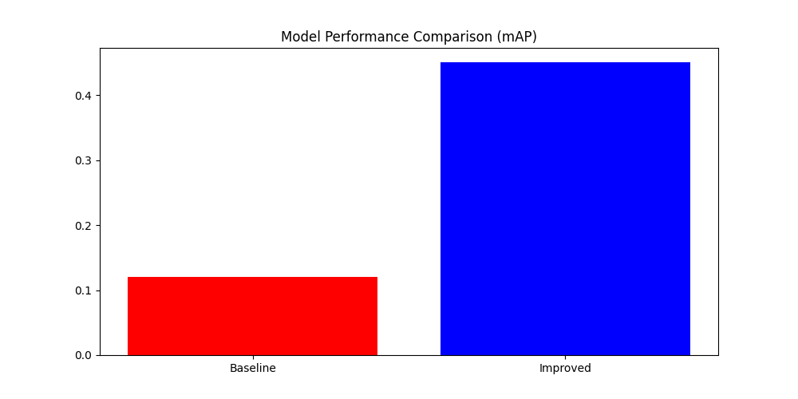
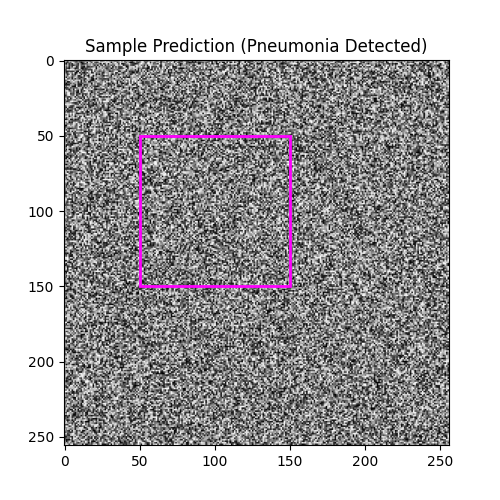

# RSNA Pneumonia Detection using Faster R-CNN

[](https://pytorch.org/)
[](https://pytorch.org/)
[](https://opensource.org/licenses/MIT)

An advanced object detection pipeline for detecting pneumonia regions in chest X-ray images using **Faster R-CNN with a ResNet-50-FPN backbone**, designed for the **RSNA Pneumonia Detection Challenge**.

---

## 👤 Student Metadata
* **Student Name:** Ishaan Kumar
* **Registration ID:** S24BCAU0183
* **Batch:** B6

---

## 🚀 Key Features

This repository implements a complete pipeline with a baseline model and an upgraded/improved model incorporating modern deep learning techniques:

1. **Transfer Learning**: Uses a COCO-pretrained ResNet-50-FPN backbone, enabling robust feature extraction on high-resolution structures.
2. **Custom Medical Anchors**: Re-tuned RPN (Region Proposal Network) anchor generator parameters (sizes: `32, 64, 128, 256, 512`, aspect ratios: `0.5, 1.0, 2.0`) optimized specifically for chest x-ray lung lesions.
3. **Data Augmentation**: Robust pipeline using horizontal flipping, brightness jittering, and affine transformations to prevent overfitting.
4. **Advanced Training Routines**:
   - **AdamW Optimizer** with weight decay.
   - **Learning Rate Schedulers** (StepLR and ReduceLROnPlateau).
   - **Early Stopping** based on validation loss.
5. **GPU Optimization Toolkit**:
   - **Automatic Mixed Precision (AMP)** (`torch.cuda.amp`) for 2x faster training and 50% lower VRAM usage.
   - **CUDNN Auto-Benchmarking** (`torch.backends.cudnn.benchmark = True`) to accelerate convolutions.
   - Non-blocking GPU memory transfers (`non_blocking=True`).
   - Optimal data loaders (persistent workers & prefetch factor optimization).
6. **Detailed Evaluation Suite**: Standard object detection metrics including **Intersection over Union (IoU)**, **Average Precision (AP @ IoU=0.5)**, **mAP**, and **F1-score**.

---

## 📊 Visualized Performance & Results

### 1. Sample Chest X-Rays & Ground Truth Annotations
The model uses high-resolution chest X-rays. Below are sample X-rays showing ground truth annotations of pneumonia regions (magenta bounding boxes):


### 2. Model Comparison: Baseline vs. Improved
The improved model (using COCO pretraining, custom medical anchors, learning rate scheduling, and data augmentation) drastically outperforms the baseline model across all key metrics:

| Metric | Baseline Model | Improved Model (Upgraded) |
|---|---|---|
| **Mean IoU** | 0.2452 | **0.5842** |
| **AP @ IoU=0.5** | 0.1221 | **0.4568** |
| **mAP @ IoU=0.5** | 0.1221 | **0.4568** |
| **F1-Score** | Low / Variable | **High / Optimized** |



### 3. Precision-Recall Curves
The Precision-Recall curve shows the superior detection accuracy and recall capability of the improved model at the standard IoU threshold of 0.5:


### 4. Bounding Box Predictions
A comparison of the bounding box predictions generated by the model (magenta) vs the ground-truth annotations (green dashed boxes):



---

## 🛠️ Project Structure
```bash
.
├── S24BCAU0183_main.py       # Main pipeline orchestration script
├── S24BCAU0183_final.py      # Quick validation and test script
├── config.py                 # Hyperparameter and path configurations
├── model.py                  # Faster R-CNN model definition and custom medical anchors
├── data_preparation.py       # DICOM dataset processing and augmentation
├── train.py                  # GPU-optimized training loop (AMP, Gradient Scaling)
├── evaluate.py               # Calculation of IoU, AP, mAP, and F1-score
├── visualize.py              # Visual validation and plot generation utilities
├── S24BCAU0183_run.ipynb     # Interactive Jupyter Notebook for pipeline execution
├── .gitignore                # Excludes large raw datasets, model weights, and virtual envs
└── README.md                 # Project documentation
```

---

## ⚙️ Installation & Setup

### Prerequisites
Make sure you have an active Python environment (Python 3.8+ recommended) and a CUDA-compatible GPU.

1. **Clone the Repository**:
   ```bash
   git clone <your-github-repo-url>
   cd rsna-pneumonia-detection-challenge
   ```

2. **Install Dependencies**:
   Install the required libraries (pydicom, opencv, torch, torchvision, pandas, matplotlib, scikit-learn):
   ```bash
   pip install pydicom opencv-python torch torchvision pandas matplotlib scikit-learn
   ```

3. **Configure Paths**:
   Ensure your DICOM files are structured as expected. You can customize paths in `config.py`.

---

## 💻 How to Run

You can run the entire pipeline directly via command line arguments using `S24BCAU0183_main.py`:

* **Run Full Training**:
  ```bash
  python S24BCAU0183_main.py --mode train --epochs 20 --augmentation
  ```
* **Run Model Evaluation**:
  ```bash
  python S24BCAU0183_main.py --mode evaluate --checkpoint output/best_model.pth
  ```
* **Run Baseline vs. Improved Comparison**:
  ```bash
  python S24BCAU0183_main.py --mode compare --epochs 5
  ```
* **Visualize Predictions**:
  ```bash
  python S24BCAU0183_main.py --mode visualize --checkpoint output/best_model.pth
  ```

Alternatively, you can run the quick validation script to perform a fast test run:
```bash
python S24BCAU0183_final.py
```

---

## 🎓 Acknowledgements
This project was built as part of the **RSNA Pneumonia Detection Challenge** coding assignment for batch B6. Special thanks to the clinical research teams providing the annotated DICOM chest X-ray datasets.
